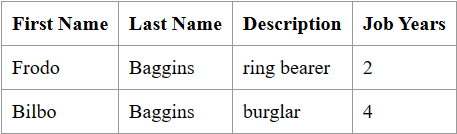
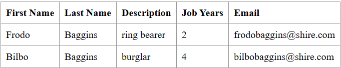

# Class Assignment 1 Report

The source code for this assignment is located in the folder [CA1/basic](https://github.com/CarlaSantos18/devops-23-24-JPE-PMS-1231825/tree/main/CA1/basic)

## Table of Contents
1. [Analysis, Design and Implementation](#1-analysis-design-and-implementation)
    1. [Analysis - Git as a Version Control System](#11-analysis---git-as-a-version-control-system)
    2. [Design](#12-design)
    3. [Implementation using Git](#13-implementation-using-git)
        1. [Part One - Adding the jobYears field](#131-part-one---adding-the-jobyears-field)
        2. [Part Two - Adding the email field](#132-part-two---adding-the-email-field)
        3. [Part Three - Fixing the email field validation](#133-part-three---fixing-the-email-field-validation)
    4. [Issues](#issues)
2. [Problems faced](#2-problems-faced)
3. [Alternative to Git - Mercurial](#3-alternative-to-git---mercurial)
    1. [Analysis](#31-analysis)
    2. [Implementation](#32-implementation)

## 1. Analysis, Design and Implementation

### 1.1. Analysis - Git as a Version Control System

A version control system is a tool that records changes to a file or set of files over time so that one can recall 
specific versions later. It allows us to revert selected files back to a previous state, revert the entire project back 
to a previous state, compare changes over time, see who last modified something that might be causing a problem, who 
introduced an issue and when, and more.

For this assignment, we were asked to use Git as a version control system. Git is a distributed version control system 
which means that clients fully mirror a repository and its history, instead of just checking out the latest snapshot of
the files held in a single server. Thus, if any server dies, and these systems were collaborating via that
server, any of the client repositories can be copied back up to the server to restore it. Every clone is really a full
backup of all the data.

For this particular assignment, we will use an already developed application named "Tutorial React.js and Spring Data Rest"
that we will add to our Git repository and develop it further.

### 1.2. Design

We will work on the "basic" version of the application provided to us and mentioned in section [1.1 Analysis - Git as a Version Control System](#11-analysis---git-as-a-version-control-system).

Regarding our repository, we should have a "master" branch to "publish" the stable versions of our work on the
application. This master branch will have tags to mark the different published versions, using the pattern
major.minor.revision (e.g., 1.1.0). The initial version will be marked with tag "**v1.1.0**". A new feature will be 
developed in the master branch, and it involves the creation of a new field on the Employee class to record the years of
the employee in the company. This new field will be an integer named "jobYears". All attributes of the Employee class
will have validation methods, and unit tests will be developed to test these validations and the creation of
Employee objects. This new version will be marked with tag "**v1.2.0**" and another tag to mark the end of the first
part of this assignment, "**ca1-part1**".

Another feature will be developed under a branch named after the feature. The new feature to be developed will involve
the creation of an email field on the Employee class, so the branch should be named "email-field".
An attribute email will be created on this Employee class, and more validations will be added for this specific field, 
as well as more unit tests to test this new feature. After successfully testing the code developed, the code from this 
branch should be merged with the master branch, marking the new version with tag "**v1.3.0**".

Furthermore, we will also create a second branch to fix a bug regarding the email field validation. This new branch 
should be called "fix-invalid-email" where we will add extra validation for the email string (e.g, an email must have 
the "@" sign.). After developing the new code, which should also include testing, this created branch should be merged 
into the master branch, tagging the new version as "**v1.3.1**". At the end of the assignment, we will tag the master
branch with "**ca1-part2**".

### 1.3. Implementation using Git

#### 1.3.1 Part One - Adding the jobYears field

We will start by cloning [this repository](https://github.com/spring-guides/tut-react-and-spring-data-rest) to our local
machine. Then:

1. We will navigate to the project repository:

```bash
cd path/to/tut-react-and-spring-data-rest
```
- command cd is used to change the current directory to the one specified in the path.

2. Copy the application into a new CA1 folder in our repository folder:

```bash
cp -r path/to/tut-react-and-spring-data-rest path/to/CA1
```
- command cp is used to copy files and directories from one location to another. The -r option is used to copy directories
and their contents recursively.

3. Initialize the repository:

```bash
cd path/to/CA1
git init
```
- command git init is used to create a new Git repository. It can be used to convert an existing, unversioned project to a
Git repository or initialize a new, empty repository.

4. Add the files to the repository:

```bash
git add .
```
- command git add is used to add file contents to the index. The "." is used to add all files in the current directory and
its subdirectories.

5. Commit the changes:

```bash
git commit -m "Initial commit"
```
- command git commit is used to record changes to the repository. The -m option is used to specify a commit message.

6. Push the commit to the remote repository:

```bash
git remote add origin <remote-repository-url>
git push -u origin master
```
- command git remote add is used to add a remote repository (if not yet linked toa remote repository). The -u option is
used to set the upstream branch for the master branch. The command git push is used to push the changes to the remote 
repository.

7. Add a tag to the initial version:

```bash
git tag v1.1.0
git push --tags v1.1.0
```
- the first command is used to create a new tag. The command git push is used to push the tags to the remote repository.

8. Add the jobYears field to the Employee class:

```java
private int jobYears;
```

9. Add the new field to the constructor:

```java
public Employee(String firstName, String lastName, String description, int jobYears) {
    this.firstName = firstName;
    this.lastName = lastName;
    this.description = description;
    this.jobYears = jobYears;
}
```

10. Add validations to the constructor to make sure the parameters are always valid:

```java
public Employee(String firstName, String lastName, String description, int jobYears){
    if(firstName == null || firstName.isEmpty() || lastName == null || lastName.isEmpty() || description == null || 
    description.isEmpty() || jobYears < 0){
       throw new InstantiationException("Invalid parameters");
    }
    this.firstName = firstName;
    this.lastName = lastName;
    this.description = description;
    this.jobYears = jobYears;
}
```

11. Add getters and setters for the new field:

```java
public int getJobYears() {
    return jobYears;
}

public void setJobYears(int jobYears) {
    this.jobYears = jobYears;
}
```

12. Add the new field to the toString method:

```java
@Override
public String toString() {
    return "Employee{" +
            "id=" + id +
            ", firstName='" + firstName + '\'' +
            ", lastName='" + lastName + '\'' +
            ", description='" + description + '\'' +
            ", jobYears=" + jobYears +
            '}';
}
```

13. Add the new field to the equals and hashCode methods:

```java
@Override
public boolean equals(Object o) {
    if (this == o) return true;
    if (o == null || getClass() != o.getClass()) return false;
    Employee employee = (Employee) o;
    return Objects.equals(id, employee.id) && 
            Objects.equals(firstName, employee.firstName) && 
            Objects.equals(lastName, employee.lastName) && 
            Objects.equals(description, employee.description) && 
            Objects.equals(jobYears, employee.jobYears);
}

@Override
public int hashCode() {
    return Objects.hash(id, firstName, lastName, description, jobYears);
}
```

14. Create a new test class for the Employee class and add unit tests for the creation of Employee objects and the
validations of all fields:

```java
class EmployeeTest {

    @Test
    void createEmployee() throws InstantiationException {
        //Arrange
        String firstName = "Frodo";
        String lastName = "Baggins";
        String description = "ring bearer";
        int jobYears = 2;
        //Act
        Employee employee = new Employee(firstName, lastName, description, jobYears);
        //Assert
        assertEquals("Frodo", employee.getFirstName());
        assertEquals("Baggins", employee.getLastName());
        assertEquals("ring bearer", employee.getDescription());
        assertEquals(2, employee.getJobYears());
    }

    @Test
    void createEmployee_ThrowsExceptionNullFirstName() {
        //Arrange
        String firstName = null;
        String lastName = "Baggins";
        String description = "ring bearer";
        int jobYears = 2;
        //Act & Assert
        assertThrows(InstantiationException.class, () -> new Employee(firstName, lastName, description, jobYears));
    }

    @Test
    void createEmployee_ThrowsExceptionNullLastName() {
        //Arrange
        String firstName = "Frodo";
        String lastName = null;
        String description = "ring bearer";
        int jobYears = 2;
        //Act & Assert
        assertThrows(InstantiationException.class, () -> new Employee(firstName, lastName, description, jobYears));
    }

    @Test
    void createEmployee_ThrowsExceptionNullDescription() {
        //Arrange
        String firstName = "Frodo";
        String lastName = "Baggins";
        String description = null;
        int jobYears = 2;
        //Act & Assert
        assertThrows(InstantiationException.class, () -> new Employee(firstName, lastName, description, jobYears));
    }

    @Test
    void createEmployee_ThrowsExceptionNegativeJobYears() {
        //Arrange
        String firstName = "Frodo";
        String lastName = "Baggins";
        String description = "ring bearer";
        int jobYears = -2;
        //Act & Assert
        assertThrows(InstantiationException.class, () -> new Employee(firstName, lastName, description, jobYears));
    }

    @Test
    void createEmployee_ThrowsExceptionEmptyFirstName() {
        //Arrange
        String firstName = "";
        String lastName = "Baggins";
        String description = "ring bearer";
        int jobYears = 2;
        //Act & Assert
        assertThrows(InstantiationException.class, () -> new Employee(firstName, lastName, description, jobYears));
    }

    @Test
    void createEmployee_ThrowsExceptionEmptyLastName() {
        //Arrange
        String firstName = "Frodo";
        String lastName = "";
        String description = "ring bearer";
        int jobYears = 2;
        //Act & Assert
        assertThrows(InstantiationException.class, () -> new Employee(firstName, lastName, description, jobYears));
    }

    @Test
    void createEmployee_ThrowsExceptionEmptyDescription() {
        //Arrange
        String firstName = "Frodo";
        String lastName = "Baggins";
        String description = "";
        int jobYears = 2;
        //Act & Assert
        assertThrows(InstantiationException.class, () -> new Employee(firstName, lastName, description, jobYears));
    }
}
```

15. Add the new field to the render methods in the app.js javascript file:

```javascript
class EmployeeList extends React.Component{
	render() {
		const employees = this.props.employees.map(employee =>
			<Employee key={employee._links.self.href} employee={employee}/>
		);
		return (
			<table>
				<tbody>
					<tr>
						<th>First Name</th>
						<th>Last Name</th>
						<th>Description</th>
						<th>Job Years</th>
					</tr>
					{employees}
				</tbody>
			</table>
		)
	}
}
````
```javascript
class Employee extends React.Component{
	render() {
		return (
			<tr>
				<td>{this.props.employee.firstName}</td>
				<td>{this.props.employee.lastName}</td>
				<td>{this.props.employee.description}</td>
				<td>{this.props.employee.jobYears}</td>
			</tr>
		)
	}
}
````

16. Add the new field to the run method in the DatabaseLoader class:

```java
@Override
public void run(String... strings) throws Exception {
    this.repository.save(new Employee("Frodo", "Baggins", "ring bearer", 2));
    this.repository.save(new Employee("Bilbo", "Baggins", "burglar", 4));
}
```

17. Using the bash terminal, run the following command:
    
```bash
./mvnw spring-boot:run
```
- this command is used to run the application.

18. Open a web browser and navigate to [http://localhost:8080](http://localhost:8080) to see the application running and
the changes made. It should look like this:


19. Commit and push the changes:

```bash
git add .
git commit -m "Add jobYears field to Employee class"
git push
```

20. Add a tag to the new version:

```bash
git tag v1.2.0
git push --tags v1.2.0
```

21. Add a tag to mark the end of the first part of the assignment:

```bash
git tag ca1-part1
git push --tags ca1-part1
```

#### 1.3.2 Part Two - Adding the email field

For this second part of the assignment, we will create a new branch to develop the new feature. We will name this branch
"email-field".

1. Create a new branch:

```bash
git branch email-field
```

2. Switch to the new branch:

```bash
git checkout email-field
```

3. Push the new branch to the remote repository:

```bash
git push -u origin email-field
```

4. Add the email field to the Employee class:

```java
private String email;
```

5. Add the new field to the constructor:

```java
public Employee(String firstName, String lastName, String description, int jobYears, String email) {
    this.firstName = firstName;
    this.lastName = lastName;
    this.description = description;
    this.jobYears = jobYears;
    this.email = email;
}
```

6. Add validations to the constructor to make sure the parameters are always valid:

```java
public Employee(String firstName, String lastName, String description, int jobYears, String email){
    if(firstName == null || firstName.isEmpty() || lastName == null || lastName.isEmpty() || description == null || 
    description.isEmpty() || jobYears < 0 || email == null || email.isEmpty()){
       throw new InstantiationException("Invalid parameters");
    }
    this.firstName = firstName;
    this.lastName = lastName;
    this.description = description;
    this.jobYears = jobYears;
    this.email = email;
}
```

7. Add getters and setters for the new field:

```java
public String getEmail() {
    return email;
}

public void setEmail(String email) {
    this.email = email;
}
```

8. Add the new field to the toString method:

```java
@Override
public String toString() {
    return "Employee{" +
            "id=" + id +
            ", firstName='" + firstName + '\'' +
            ", lastName='" + lastName + '\'' +
            ", description='" + description + '\'' +
            ", jobYears=" + jobYears +
            ", email='" + email + '\'' +
            '}';
}
```

9. Add the new field to the equals and hashCode methods:

```java
@Override
public boolean equals(Object o) {
    if (this == o) return true;
    if (o == null || getClass() != o.getClass()) return false;
    Employee employee = (Employee) o;
    return Objects.equals(id, employee.id) && 
            Objects.equals(firstName, employee.firstName) && 
            Objects.equals(lastName, employee.lastName) && 
            Objects.equals(description, employee.description) && 
            Objects.equals(jobYears, employee.jobYears) && 
            Objects.equals(email, employee.email);
}

@Override
public int hashCode() {
    return Objects.hash(id, firstName, lastName, description, jobYears, email);
}
```

10. Change the test class for the Employee class to add unit tests for the new email field:

```java
class EmployeeTest {

    @Test
    void createEmployee() throws InstantiationException {
        //Arrange
        String firstName = "Frodo";
        String lastName = "Baggins";
        String description = "ring bearer";
        int jobYears = 2;
        String email = "frogobaggins@shire.com";
        //Act
        Employee employee = new Employee(firstName, lastName, description, jobYears,email);
        //Assert
        assertEquals("Frodo", employee.getFirstName());
        assertEquals("Baggins", employee.getLastName());
        assertEquals("ring bearer", employee.getDescription());
        assertEquals(2, employee.getJobYears());
        assertEquals(email, employee.getEmail());
    }

    @Test
    void createEmployee_ThrowsExceptionNullFirstName() {
        //Arrange
        String firstName = null;
        String lastName = "Baggins";
        String description = "ring bearer";
        int jobYears = 2;
        String email = "frodobaggins@shire.com";
        //Act & Assert
        assertThrows(InstantiationException.class, () -> new Employee(firstName, lastName, description, jobYears,email));
    }

    @Test
    void createEmployee_ThrowsExceptionNullLastName() {
        //Arrange
        String firstName = "Frodo";
        String lastName = null;
        String description = "ring bearer";
        int jobYears = 2;
        String email = "frodobaggins@shire.com";
        //Act & Assert
        assertThrows(InstantiationException.class, () -> new Employee(firstName, lastName, description, jobYears,email));
    }

    @Test
    void createEmployee_ThrowsExceptionNullDescription() {
        //Arrange
        String firstName = "Frodo";
        String lastName = "Baggins";
        String description = null;
        int jobYears = 2;
        String email = "frodobaggins@shire.com";
        //Act & Assert
        assertThrows(InstantiationException.class, () -> new Employee(firstName, lastName, description, jobYears,email));
    }

    @Test
    void createEmployee_ThrowsExceptionNegativeJobYears() {
        //Arrange
        String firstName = "Frodo";
        String lastName = "Baggins";
        String description = "ring bearer";
        int jobYears = -2;
        String email = "frodobaggins@shire.com";
        //Act & Assert
        assertThrows(InstantiationException.class, () -> new Employee(firstName, lastName, description, jobYears,email));
    }

    @Test
    void createEmployee_ThrowsExceptionEmptyFirstName() {
        //Arrange
        String firstName = "";
        String lastName = "Baggins";
        String description = "ring bearer";
        int jobYears = 2;
        String email = "frodobaggins@shire.com";
        //Act & Assert
        assertThrows(InstantiationException.class, () -> new Employee(firstName, lastName, description, jobYears,email));
    }

    @Test
    void createEmployee_ThrowsExceptionEmptyLastName() {
        //Arrange
        String firstName = "Frodo";
        String lastName = "";
        String description = "ring bearer";
        int jobYears = 2;
        String email = "frodobaggins@shire.com";
        //Act & Assert
        assertThrows(InstantiationException.class, () -> new Employee(firstName, lastName, description, jobYears,email));
    }

    @Test
    void createEmployee_ThrowsExceptionEmptyDescription() {
        //Arrange
        String firstName = "Frodo";
        String lastName = "Baggins";
        String description = "";
        int jobYears = 2;
        String email = "frodobaggins@shire.com";
        //Act & Assert
        assertThrows(InstantiationException.class, () -> new Employee(firstName, lastName, description, jobYears,email));
    }

    @Test
    void createEmployee_ThrowsExceptionEmptyEmail() {
        //Arrange
        String firstName = "Frodo";
        String lastName = "Baggins";
        String description = "ring bearer";
        int jobYears = 2;
        String email = "";
        //Act & Assert
        assertThrows(InstantiationException.class, () -> new Employee(firstName, lastName, description, jobYears,email));
    }

    @Test
    void createEmployee_ThrowsExceptionNullEmail() {
        //Arrange
        String firstName = "Frodo";
        String lastName = "Baggins";
        String description = "ring bearer";
        int jobYears = 2;
        String email = null;
        //Act & Assert
        assertThrows(InstantiationException.class, () -> new Employee(firstName, lastName, description, jobYears,email));
    }
}
```

11. Add the new field to the render methods in the app.js javascript file:

```javascript
class EmployeeList extends React.Component{
    render() {
        const employees = this.props.employees.map(employee =>
            <Employee key={employee._links.self.href} employee={employee}/>
        );
        return (
            <table>
                <tbody>
                    <tr>
                        <th>First Name</th>
                        <th>Last Name</th>
                        <th>Description</th>
                        <th>Job Years</th>
                        <th>Email</th>
                    </tr>
                    {employees}
                </tbody>
            </table>
        )
    }
}
````
```javascript
class Employee extends React.Component{
    render() {
        return (
            <tr>
                <td>{this.props.employee.firstName}</td>
                <td>{this.props.employee.lastName}</td>
                <td>{this.props.employee.description}</td>
                <td>{this.props.employee.jobYears}</td>
                <td>{this.props.employee.email}</td>
            </tr>
        )
    }
}
````

12. Add the new field to the run method in the DatabaseLoader class:

```java
@Override
public void run(String... strings) throws Exception {
    this.repository.save(new Employee("Frodo", "Baggins", "ring bearer",2, "frodobaggins@shire.com"));
    this.repository.save(new Employee("Bilbo", "Baggins", "burglar",4, "bilbobaggins@shire.com"));
	}
```

13. Using the bash terminal, run the following command:
    
```bash
./mvnw spring-boot:run
```

14. Open a web browser and navigate to [http://localhost:8080](http://localhost:8080) to see the application running and
the changes made. It should look like this:


15. Commit the changes to the email-field branch:

```bash
git commit -a -m "Add email field to Employee class"
```

16. Switch back to the master branch:

```bash
git checkout master
```

17. Merge the email-field branch into the master branch:

```bash
git merge --no-ff email-field
```

18. Push the changes to the remote repository:

```bash
git push origin master
```

19. Add a tag to the new version:

```bash
git tag v1.3.0
git push --tags v1.3.0
```

#### 1.3.3 Part Three - Fixing the email field validation

We will create a new branch to fix a bug regarding the email field validation. We will name this branch "fix-invalid-email".
For this, the steps are similar to steps 1-3 in section [1.3.2 Part Two - Adding the email field](#132-part-two---adding-the-email-field).

After creating the new branch and switching to it, we will update the validation for the email field in the Employee class
to make sure the email string is valid (e.g., it must have the "@" sign).

1. Add the new validation to the constructor:

```java
public Employee(String firstName, String lastName, String description, int jobYears, String email){
    if(firstName == null || firstName.isEmpty() || lastName == null || lastName.isEmpty() || description == null || 
    description.isEmpty() || jobYears < 0 || email == null || !email.contains("@")){
       throw new InstantiationException("Invalid parameters");
    }
    this.firstName = firstName;
    this.lastName = lastName;
    this.description = description;
    this.jobYears = jobYears;
    this.email = email;
}
```

2. Change the test class for the Employee class to add unit tests for the new email field validation:

```java
class EmployeeTest{
    
    //...
    
    @Test
    void createEmployee_ThrowsExceptionInvalidEmail() {
        //Arrange
        String firstName = "Frodo";
        String lastName = "Baggins";
        String description = "ring bearer";
        int jobYears = 2;
        String email = "frodobagginsshire.com";
        //Act & Assert
        assertThrows(InstantiationException.class, () -> new Employee(firstName, lastName, description, jobYears,email));
    }
}
```

3. Commit the changes to the fix-invalid-email branch:

```bash
git commit -a -m "Fix email field validation"
```

4. Switch back to the master branch:

```bash
git checkout master
```

5. Merge the fix-invalid-email branch into the master branch:

```bash
git merge --no-ff fix-invalid-email
```

6. Push the changes to the remote repository:

```bash
git push origin master
```

7. Add a tag to the new version:

```bash
git tag v1.3.1
git push --tags v1.3.1
```

8. Add a tag to mark the end of the second part of the assignment:

```bash
git tag ca1-part2
git push --tags ca1-part2
```

### Issues

For this assignment, we were encouraged to use the issue tracking system provided by GitHub. Issues can be used to keep
track of bugs, enhancements, or other requests. They can be created in the GitHub repository website or using the
following command:

```bash
git issue add "Issue title" -m "Issue description"
```

An issue can be closed by linking it to a commit message. For example, if the issue is number 1, the commit message
should contain the following:

```bash
git commit -m "Commit message. Closes #1"
```

## 2. Problems faced

During the second part of the assignment, as I was following the theoretical slides given to us, I didn't run the command 
to push the new branch to the remote repository after creating the new branch and switching to it, since that command isn't
featured in those slides. I ran the command to push the new branch to the remote repository
after making changes to the code, committing them and merging into the master branch. This was a problem because it made it seem like the new feature
was developed in the master branch, which is not the best practice. 

For the second branch I didn't have this problem because I ran the command to push the new branch to the repository
right after creating it.

However, since I didn't create issues while developing the new features, I had to go back and create them after the
changes were made. This was a problem because I was supposed to create issues before making changes to the code, so I
could link the issues to the commits that fixed them. To fix this, I followed professor Paulo's advice and created the
issues, changed the commit messages to link the issues, and pushed the changes to the remote repository.

To change the commit messages, I used the following command:

```bash
git rebase -i HEAD~n
```
This command is used to rewrite the commit history. The -i option is used to open an interactive rebase session. The HEAD
is a reference to the last commit in the current branch, and the ~n is used to specify the number of commits to be
rebased. After running this command, a text editor will open with the commits to be rebased. 

I changed the word "pick" to"reword" in the commit messages I wanted to change, saved the changes, and closed the text 
editor. Then, another text editor opened with the commit message I wanted to change. I changed the message by adding the
"Closes #issue-number" at the end of the message, saved the changes, and closed the text editor. After that, I ran the
following command to push the changes to the remote repository:

```bash
git push origin master --force
```

## 3. Alternative to Git - Mercurial

### 3.1. Analysis
Mercurial is also a distributed version control system, the same as Git, but there are some key differences worth
pointing out, one of them being the **branching structure**.

In Git, branches are only references to a certain commit.
This makes them lightweight yet powerful. Git allows someone to create, delete, and change a branch anytime,
without affecting the commits. If someone needs to test a new feature or find a bug — make a branch, do the changes,
and then delete the branch.

Branching in Mercurial doesn't share the same meaning. They refer to a linear line of consecutive changesets.
Changesets (csets) refer to a complete set of changes made to a file in a repository. Mercurial embeds the branches
in the commits, where they are stored forever. This means that branches cannot be removed because that would
alter the history. However, one can refer to certain commits with bookmarks, and use them in a similar manner
to Git’s branches.

As for another difference between the two VCS, Git supports the idea of a staging area,
which is also known as the index file, while Mercurial does not.

### 3.2. Implementation

To use Mercurial, we can run the commands on the Windows command line.

1. To start using Mercurial, we need to install it. It can be downloaded from the official [Mercurial website](https://www.mercurial-scm.org/).

2. After installing Mercurial, we can start by creating a new local repository with the name of the folder where the
project will be:

```shell
hg init name-of-the-project
```

3. Copy the files from the application into the new folder (excluding the .git folder).

4. As the new Mercurial repository has now new files, we should run the following command to commit them:

```shell
hg commit -m "Initial commit"
```

5. To add a tag to the initial version, we can run the following command:

```shell
hg tag v1.1.0
```

6. Push the repository to the remote repository:

```shell
hg push <remote-repository-url>
```

7. Add the jobYears field (similar to steps 8-16 in section [1.3.1 Part One - Adding the jobYears field](#131-part-one---adding-the-jobyears-field))
and commit the changes:

```shell
hg commit -m "Add jobYears field to Employee class"
```

8. Add a tag to the new version:

```shell
hg tag v1.2.0
```

9. Add a tag to mark the end of the first part of the assignment:

```shell
hg tag ca1-part1
```

10. Create a new branch to develop the new feature:

```shell
hg branch email-field
```
- The default mercurial branch is called "**default**", and by creating a new branch, the active branch
  switches automatically to the new branch (no need to checkout like in Git). We can check the active branch with the
"hg branch" command.

11. Push the new branch to the remote repository:

```shell
hg push --email-field
```

12. Add the email field (similar to steps 4-14 in section [1.3.2 Part Two - Adding the email field](#132-part-two---adding-the-email-field))


13. Commit and push the changes to the email-field branch:

```shell
hg commit -m "Add email field to Employee class"
hg push
```

14. Switch back to the default branch:

```shell
hg update default
```

15. Merge the email-field branch into the default branch:

```shell
hg merge email-field
```

16. Commit the merge:

```shell
hg commit -m "Merge email-field branch into default branch"
```

17. Tag and push the new version:

```shell
hg tag v1.3.0
hg push
```

18. Create a new branch to fix a bug regarding the email field validation:

```shell
hg branch fix-invalid-email
```

19. Push the new branch to the remote repository:

```shell
hg push --fix-invalid-email
```

20. Add the new validation to the constructor (similar to steps 1-2 in section [1.3.3 Part Three - Fixing the email field validation](#133-part-three---fixing-the-email-field-validation))


21. Commit the changes to the fix-invalid-email branch:

```shell
hg commit -m "Fix email field validation"
```

22. Switch back to the default branch:

```shell
hg update default
```

23. Merge the fix-invalid-email branch into the default branch:

```shell
hg merge fix-invalid-email
```

24. Commit the merge:

```shell
hg commit -m "Merge fix-invalid-email branch into default branch"
```

25. Tag and push the new version:

```shell
hg tag v1.3.1
hg push
```

26. Add a tag to mark the end of the second part of the assignment:

```shell
hg tag ca1-part2
hg push
```

## References
[1] : PPT slides provided by the professors

[2] : https://www.perforce.com/blog/vcs/mercurial-vs-git-how-are-they-different

[3] : https://www.mercurial-scm.org/quickstart


