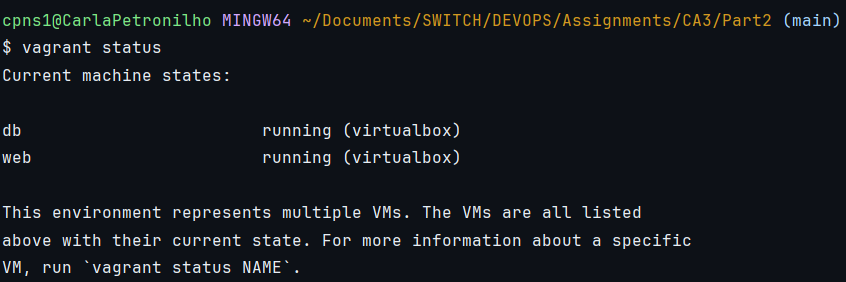
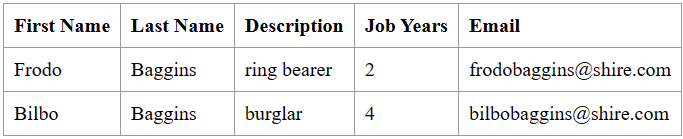
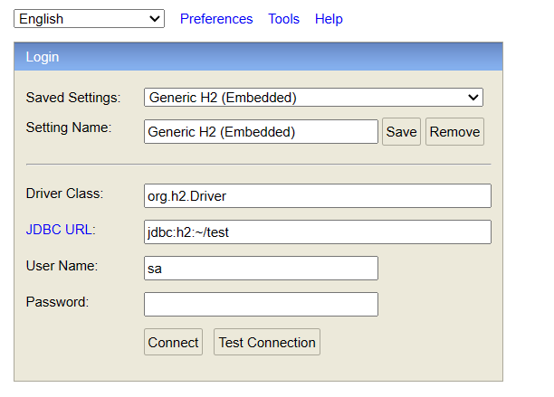

# Class Assignment 3 Report

## Part 2: Virtualization with Vagrant

### 1. Analysis: Vagrant and VirtualBox

Vagrant is an open-source tool for building and managing virtualized development environments. It provides a way to 
automate the setup of virtual machines or containers, making it easier for developers to create consistent development 
environments across different machines. With Vagrant, developers can define the configuration of their development 
environment using simple and reproducible scripts, known as Vagrantfiles. These scripts specify things like the 
operating system, software packages, network settings...

Vagrant works with popular virtualization providers such as VirtualBox, VMware, and Docker, allowing developers to use 
the virtualization technology of their choice.

VirtualBox is a free and open-source virtualization software that allows users to run multiple operating systems on a
single physical machine. It provides a way to create and manage virtual machines, which are isolated environments that 
can run different operating systems and applications. VirtualBox supports a wide range of guest operating systems, 
including Windows, Linux, and macOS, making it a versatile tool for developers and IT professionals.

### 2. Implementation with VirtualBox

For this assignment, I installed Vagrant on my local machine. I already had VirtualBox installed, so I used it as the
virtualization provider for Vagrant.

Following the instructions provided in the assignment, I created a new directory for **Part2** of CA3 and copied the Vagrantfile
provided by the teacher into this new directory. However, many changes needed to be done to the Vagrantfile in order to
make it work, like changing the jdk version, the ubuntu version, the tomcat version...etc.

Next, some changes were made to the application present in **CA2/Part2/react-and-spring-data-rest-gradle**. The 
application.properties file was updated to use the correct database URL and username, as well as other necessary
configuration settings:

```groovy
server.servlet.context-path=/react-and-spring-data-rest-basic-0.0.1-SNAPSHOT
spring.data.rest.base-path=/api
#spring.datasource.url=jdbc:h2:mem:jpadb
# In the following settings the h2 file is created in /home/vagrant folder
spring.datasource.url=jdbc:h2:tcp://192.168.56.11:9092/./jpadb;DB_CLOSE_DELAY=-1;DB_CLOSE_ON_EXIT=FALSE
spring.datasource.driverClassName=org.h2.Driver
spring.datasource.username=sa
spring.datasource.password=
spring.jpa.database-platform=org.hibernate.dialect.H2Dialect
# So that spring will no drop de database on every execution.
spring.jpa.hibernate.ddl-auto=update
spring.h2.console.enabled=true
spring.h2.console.path=/h2-console
spring.h2.console.settings.web-allow-others=true
```

I also updated the app.js file componentDidMount() method to include the correct path to the API endpoint:

```javascript
componentDidMount() { // <2>
		client({method: 'GET', path: '/react-and-spring-data-rest-basic-0.0.1-SNAPSHOT/api/employees'}).done(response => {
			this.setState({employees: response.entity._embedded.employees});
		});
	}
```

Then I added a plugin and another dependency to the build.gradle file:

```groovy
plugins {
    id 'org.springframework.boot' version '2.5.4'
    id 'io.spring.dependency-management' version '1.0.11.RELEASE'
    id 'java'
    id 'war'
}

dependencies {
	implementation 'org.springframework.boot:spring-boot-starter-data-jpa'
	implementation 'org.springframework.boot:spring-boot-starter-data-rest'
	implementation 'org.springframework.boot:spring-boot-starter-thymeleaf'
	runtimeOnly 'com.h2database:h2'
	testImplementation 'org.springframework.boot:spring-boot-starter-test'
	providedRuntime 'org.springframework.boot:spring-boot-starter-tomcat'
}
```

Finally, I added a new class to **src/main/java/com/greglturnquist/payroll** called **ServletInitializer** that allows
the application to build war files:

```java
package com.greglturnquist.payroll;

import org.springframework.boot.builder.SpringApplicationBuilder;
import org.springframework.boot.web.servlet.support.SpringBootServletInitializer;

public class ServletInitializer extends SpringBootServletInitializer {

    @Override
    protected SpringApplicationBuilder configure(SpringApplicationBuilder application) {
        return application.sources(ReactAndSpringDataRestApplication.class);
    }

}
```
After making these changes, I ran the command to run the Vagrantfile:

```bash
vagrant up
```

By the end of the process, I ran the following command to check the status of the new VM's:

```bash
vagrant status
```

The output was:


Then, to check if both VM's were actually doing what they were supposed to do, I accessed the following URLs:

- http://192.168.56.10:8080/react-and-spring-data-rest-basic-0.0.1-SNAPSHOT/ (for the web VM)



- http://192.168.56.10:8080/react-and-spring-data-rest-basic-0.0.1-SNAPSHOT/h2-console (for the database VM)



By the end of the process, I ran the following command to destroy the VM's:

```bash
vagrant destroy -f
```

I commited the changes but commented them so that the **CA2/Part2/react-and-spring-data-rest-gradle** application is still
functional. However, the changes can be seen in the repository and to test the **CA3/Part2** assignment, you just need
to uncomment the changes in the **application.properties** file, **app.js** file, and the **index.html** file.

Since part 2 of the assignment was completed successfully, I tagged the repository with the tag **ca3-part2**.

### 3. Analysis of an Alternative to VirtualBox - Hyper-V

Hyper-V is a virtualization technology developed by Microsoft that allows users to run multiple operating systems on a
single physical machine. It is available as a feature in Windows 10 Pro, Enterprise, and Education editions, as well as
Windows Server operating systems. Hyper-V provides a way to create and manage virtual machines, which are isolated
environments that can run different operating systems and applications.

Unlike VirtualBox, which is a standalone application, Hyper-V is integrated into the Windows operating system, making it
easier to use for Windows users as well as providing better performance and security. Hyper-V also supports features
like dynamic memory allocation, virtual machine replication, and live migration, which can be useful for managing
virtualized environments in enterprise settings.

### 4. Implementation with Hyper-V

To use Hyper-V as an alternative to VirtualBox for running Vagrant virtual machines, you need to have a Windows 10 Pro,
Enterprise, or Education edition installed on your machine. Hyper-V is not available in Windows 10 Home edition. 

Because I have a Windows 11 Home edition, I was not able to test the implementation with Hyper-V. However, the process
of setting up Vagrant with Hyper-V is similar to using VirtualBox. You need to install Vagrant on your local machine and
enable the Hyper-V feature in Windows. You can then create a new Vagrantfile and specify Hyper-V as the provider, as seen
in the Vagrantfile in the **CA3/Part2/Hyper-V** directory.

You can then run the `vagrant up` command to create and start the virtual machine using Hyper-V. You can also use other
Vagrant commands like `vagrant halt`, `vagrant destroy`, and `vagrant status` to manage the virtual machine.

Overall, Hyper-V is a powerful virtualization technology that can be used as an alternative to VirtualBox for running
Vagrant virtual machines on Windows operating systems.


