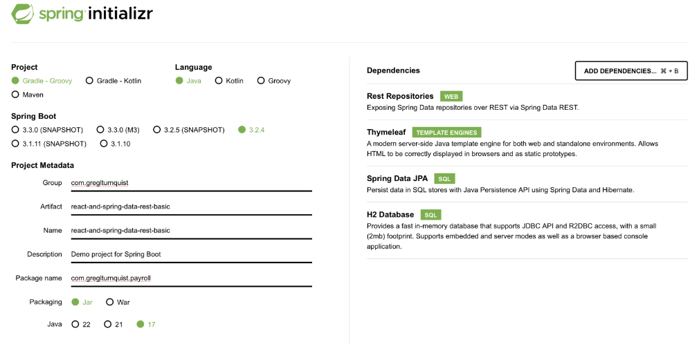

# Class Assignment 2 Report

The source code for this assignment is located in the folder [CA2/Part2/react-and-spring-data-rest-basic-gradle](https://github.com/CarlaSantos18/devops-23-24-JPE-PMS-1231825/tree/main/CA2/Part2/react-and-spring-data-rest-basic-gradle).

## Table of Contents

- [Part 2 - Analysis, design and implementation using Gradle](#part-2---analysis-design-and-implementation-using-gradle)
  - [1. Analysis - Gradle as Build Tool](#1-analysis---gradle-as-build-tool)
  - [2. Design](#2-design)
  - [3. Implementation using Gradle](#3-implementation-using-gradle)
  - [4. Analysis of an Alternative](#4-alternative-implementation---maven)
  - [5. Final Remarks](#5-final-remarks)
  - [6. References](#6-references)

## Part 2 - Analysis, design and implementation using Gradle

### 1. Analysis - Gradle as Build Tool

**Gradle** is an open-source build tool with a focus on build automation and support for multi-language development.
If we are building, testing, publishing, and deploying software on any platform, Gradle offers a flexible
model that can support the entire development lifecycle from compiling and packaging code to publishing websites.
Gradle has been designed to support build automation across multiple languages and platforms including Java, Scala,
Android, Kotlin, C/C++, and Groovy, and is closely integrated with development tools and continuous integration
servers including Eclipse, IntelliJ, and Jenkins (*[Gradle][1]*). **Gradle** build scripts are written using a **Groovy**
or **Kotlin** DSL, and completes tasks quickly by reusing outputs from previous executions, processing only inputs
that changed and executing tasks in parallel (*[GradleTutorial][2]*). It is one of the most popular build tools for
java projects, as it derives all the best and integrates will with **Ivy**, **Ant** and **Maven**.

### 2. Design

For this assignment, the goal is to convert the basic version of the application used in **CA1** to Gradle
(instead of Maven).

We should create a new branch called "**tut-basic-gradle**" where we will develop the features for this assignment.

We will then start a new gradle spring project with dependencies (Rest Repositories; Thymeleaf; JPA; H2) in
(https://start.spring.io/).

After extracting the generated zip file, we will have an "empty" spring application that can be built using gradle.

After deleting the 'src' folder of this new project, we should copy the 'src' folder from the basic version of the app
used in **CA1**, along with the files 'webpack.config.js' and 'package.json' into our new project.
Inside the 'src' folder that we will be using, we should delete the folder src/main/resources/static/built/ since it
should be generated anew from the javascript by the tool webpack.

To experiment the application initialization we should use `./gradlew bootRun`. It is expected that the web page
http://localhost:8080 will be empty, since gradle is still missing the plugin to handle the frontend code.

So, as a next step, we should add the gradle plugin **org.siouan.frontend** to the project, so gradle is able the manage
the frontend. The code to be added is detailed in the [Implementation using Gradle](#3-implementation-using-gradle) section.

After dealing with the dependencies, we can use `./gradlew build` to build the application and apply the changes and
then run again `./gradlew bootRun` to execute the application and confirm that the frontend is now working.

Now, we should create a custom task that will copy the generated .jar file to a folder named 'dist' located at the
project root folder level, and then another task to delete all the files generated by webpack in
'src/resources/main/static/built/'. This new task should be executed automatically by gradle before the task **clean**.

After the development of the new features is complete, we should merge the changes made in the branch created with the
master branch.

After writing this class assignment report, the repository should be tagged "**ca2-part2**".

### 3. Implementation using Gradle

Every command was ran using **Git Bash**.
Several issues were created.

I started by creating a new branch to develop the Part 2 of this class assignment, named '**tut-basic-gradle**'.

```bash
$ git branch tut-basic-gradle
```

Then I moved the HEAD pointer to this new branch:
```bash
$ git checkout tut-basic-gradle
```

Now we're ready to start making changes.

I started by creating a new folder named "Part2" inside the folder "CA2".

Next, by going to (https://start.spring.io), we can generate a new Gradle project with some dependencies already coupled
to it:



After choosing the options above, we just need to click on GENERATE to download the new project.

I named the new project root folder '**react-and-spring-data-rest-basic-gradle**' and copied it to the folder 'Part2'.

Next, I deleted the existing '**src**' folder and copied the '**src**' folder from the project '**react-and-spring-data-rest-basic**'
that was used in the first assignment (CA1).
I also copied the files '**webpack.config.js**' and '**package.json**' from the same project.

Then I deleted the folder '**src/main/resources/static/built/**' since this folder should be generated from the javascript by
the webpack tool.

I also needed to change the imports in the **Employee.java** class:
```java
import jakarta.persistence.Entity;
import jakarta.persistence.GeneratedValue;
import jakarta.persistence.Id;
```

At this point I opted for making a commit to save the changes made so far and close the issue #17:
```bash
$ git add .
$ git commit -m "copy src folder from tutorial to CA2/Part2. Fixes #17"
$ git push origin tut-basic-gradle
```

We are now ready to run the application. Just type the following in Git Bash:
```bash
$ ./gradlew bootRun
```
The app was now running, but the page located at http://localhost:8080 was empty. This is because Gradle is missing the 
plugin to deal with the frontend code.

To solve this, we will add the Gradle plugin "**org.siouan.frontend**" to the project, so that Gradle is able to
properly manage the frontend. We should add the following line to the plugins block in the **build.gradle** file:

```groovy
id 'org.siouan.frontend-jdk17' version '8.0.0'
```

We also need to configure the previous plugin by adding:

```groovy
frontend {
    nodeVersion = "16.20.2"
    assembleScript = "run build"
    cleanScript = "run clean"
    checkScript = "run check"
}
```

Now, updating the scripts section/object in the **package.json** file, to configure the execution of webpack:

```json
"scripts": {
  "webpack": "webpack",
  "build": "npm run webpack",
  "check": "echo Checking frontend",
  "clean": "echo Cleaning frontend",
  "lint": "echo Linting frontend",
  "test": "echo Testing frontend"
},
```

And also adding the following configuration:

```json
"packageManager": "npm@9.6.7",
```
At this point, I made another commit to submit the changes and close issue #18:
```bash
$ git add .
$ git commit -m "add and configure plugin. Fixes #18"
$ git push
```

If everything is set, we will build the application to apply the changes made:

```bash
$ ./gradlew build
```

The tasks related to the frontend are executed and the frontend code is generated.
Now we can try running the application to see if it worked:
```bash
$ ./gradlew bootRun
```

By checking the http://localhost:8080 again, we can see that the content now appears as it should.

With the build of the application, some folders were created that needed to be added to the **.gitignore** file:
```
node_modules/
.frontend-gradle-plugin/
node/
src/main/resources/static/built/
```

Next, I created a new task that should copy the generated .jar file to a folder named "**dist**" located at the project 
root folder level.
Thus, I added the following code to the **build.gradle** file:

```groovy
task makeJarCopy(type: Copy){
	group = "DevOps"
	description = "Creates a copy of the generated .jar file in a 'dist' folder located at the project root folder level."

	from 'build/libs/'
	into 'dist'
	include '*.jar'
}
```

To run this new task, we should do:
```bash
$ ./gradlew makeJarCopy
```
We should confirm the task did what was supposed to, by checking that a folder "**dist**" was created and that it contains
the generated .jar file.

After this, I made a commit to save the changes made so far and close issue #19:
```bash
$ git add .
$ git commit -m "create task to copy the generated jar to a folder named "dist". Fixes #19"
$ git push
```

Next, I created a new task that should delete all files generated by webpack (located at "src/main/resources/static/built/).
This new task should be automatically executed by Gradle before the execution of the task "**clean**".

Thus, I developed and added the following code to the "**build.gradle**" file:
```groovy
task deleteWebpackFiles(type: Delete) {
	group = "DevOps"
	description = "Deletes all files in the 'src/resources/main/static/built/' folder."

	delete fileTree('src/main/resources/static/built/')
}

clean.dependsOn(deleteWebpackFiles)
```

To test this new task, I ran the default "**clean**" task:
```bash
$ ./gradlew clean
```

The "**clean**" task by itself should only delete the build directory. I checked and noticed that the files inside
'**src/main/resources/static/built/**' were gone, so this proves that before Gradle ran the "**clean**" task, the
"**deleteWebpackFiles**" task ran first. The created task also runs standalone, in case we only want to delete the
aforementioned files.

After this, I made a commit to save the changes made so far and close issue #20:
```bash
$ git add .
$ git commit -m "create task to delete all the files generated by webpack and task clean. Fixes #20"
$ git push
```

Since the tasks were working as expected, I decided to merge the branch "**tut-basic-gradle**" into the branch "**main**".
To do this, I ran the following commands:
```bash
$ git checkout main
$ git merge --no-ff tut-basic-gradle
$ git push
```
The implementation using Gradle is now complete.

**At the end of Part 2 of this assignment, the repository should be marked with the tag "**ca2-part2**".**

### 4. Alternative Implementation - Maven

An alternative to using Gradle as a build tool would be to use **Maven**. Maven is a build automation tool used primarily
for Java projects. Maven addresses two aspects of building software: first, it describes how software is built, and second,
it describes its dependencies. Maven is based on the concept of a project object model (POM) in that it is a project
management tool that can manage a project's build, reporting, and documentation from a central piece of information. Maven
uses a XML file to describe the software project being built, its dependencies on other external modules and components, the
build order, directories, and required plug-ins.

The steps to implement the application using Maven would be similar to the ones in Gradle, except for the following steps:


1. Add the plugin to handle the frontend code:
```xml
<plugin>
  <groupId>com.github.eirslett</groupId>
  <artifactId>frontend-maven-plugin</artifactId>
  <version>1.9.1</version>
  <configuration>
    <installDirectory>target</installDirectory>
  </configuration>
  <executions>
    <execution>
      <id>install node and npm</id>
      <goals>
        <goal>install-node-and-npm</goal>
      </goals>
      <configuration>
        <nodeVersion>v12.14.0</nodeVersion>
        <npmVersion>6.13.4</npmVersion>
      </configuration>
    </execution>
    <execution>
      <id>npm install</id>
      <goals>
        <goal>npm</goal>
      </goals>
      <configuration>
        <arguments>install</arguments>
      </configuration>
    </execution>
    <execution>
      <id>webpack build</id>
      <goals>
        <goal>webpack</goal>
      </goals>
    </execution>
  </executions>
</plugin>
```

2. Add the task to copy the generated .jar file to a folder named "**dist**":
```xml
<plugin>
  <groupId>org.apache.maven.plugins</groupId>
  <artifactId>maven-resources-plugin</artifactId>
  <version>3.2.0</version>
  <executions>
    <execution>
      <id>copy-jar</id>
      <phase>package</phase>
      <goals>
        <goal>copy-resources</goal>
      </goals>
      <configuration>
        <outputDirectory>${project.basedir}/dist</outputDirectory>
        <resources>
          <resource>
            <directory>${project.build.directory}</directory>
            <includes>
              <include>*.jar</include>
            </includes>
          </resource>
        </resources>
      </configuration>
    </execution>
  </executions>
</plugin>
```

3. Add the task to delete all files generated by webpack:
```xml
<plugin>
  <artifactId>maven-clean-plugin</artifactId>
  <version>3.1.0</version>
  <configuration>
    <filesets>
      <fileset>
        <directory>${project.basedir}/src/main/resources/static/built</directory>
        <includes>
          <include>**/*</include>
        </includes>
      </fileset>
    </filesets>
  </configuration>
</plugin>
```

4. Compile the project:
```bash
$ ./mvnw compile
```

5. Run the project:
```bash
$ ./mvnw spring-boot:run
```

6. Run the task to copy the generated jar
```bash
$ ./mvnw package
```

7. Run the task to delete all the files generated by webpack
```bash
$ ./mvnw clean
```

8. Commit and push the changes.

The implementation using Maven is now complete.

### 5. Final Remarks

In this assignment, we learned how to use Gradle as a build tool to manage the frontend code of a Spring application.
During the initial steps of this part of the assignment, I encountered some problems which forced me to delete the original
branch and create a new one, hence the reason for some issues not showing up in GitHubs' issue tracker.

There was also some trouble with the plugin but after some feedback from our teacher we were able to solve it by adding
the package manager section to the build.gradle file.


### 6. References

[1] : https://github.com/gradle/gradle

[2] : https://www.vogella.com/tutorials/GradleTutorial/article.html

