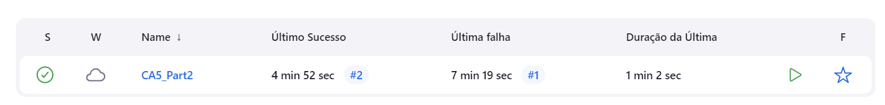
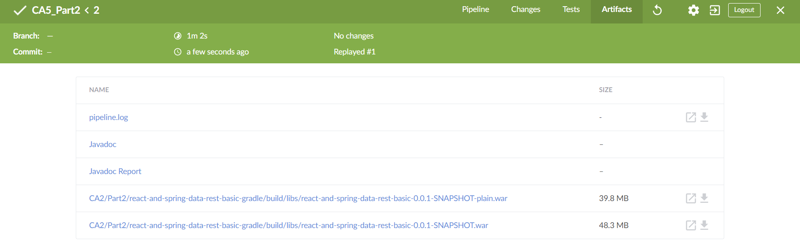

# Class Assignment 5 Report

## CI/CD pipelines with Jenkins

### Part 1 - Practice with Jenkins

For this part of the assignment, I had to install jenkins using a docker container:
```bash
docker run -d -v jenkins_home:/var/jenkins_home -p 8080:8080 -p 50000:50000 --restart=on-failure jenkins/jenkins:lts-jdk17
```

After navigating to http://localhost:8080/, I was asked for a password to unlock Jenkins, so I ran the following commands to get the
password:
```bash
docker ps -a
docker logs 8b493417bde3
```

I then created first admin with my credentials and installed the suggested plugins.

Next, I created a Jenkinsfile with the suggested stages and placed it in **CA2/Part1/gradle_basic_demo/** directory, which is the application I will 
be using for this part of the assignment.

**Note:** I also placed a copy of this Jenkinsfile in the **CA5/Part1/** directory for evaluation purposes.

```groovy
pipeline {
    agent any

    stages {
        stage('Checkout') {
            steps {
                echo 'Checking out...'
                git branch: 'main', url: 'https://github.com/CarlaSantos18/devops-23-24-JPE-PMS-1231825.git'
            }
            stage('Assemble') {
                steps {
                    echo 'Assembling...'
                    dir('CA2/Part1/gradle_basic_demo') {
                        sh 'chmod +x gradlew'
                        sh './gradlew clean assemble'
                    }
                }
            }
            stage('Test') {
                steps {
                    echo 'Testing...'
                    dir('CA2/Part1/gradle_basic_demo') {
                        sh './gradlew test'
                    }
                }
                post {
                    always {
                        junit 'CA2/Part1/gradle_basic_demo/build/test-results/test/*.xml'
                    }
                }
            }
            stage('Archive') {
                steps {
                    echo 'Archiving...'
                    archiveArtifacts 'CA2/Part1/gradle_basic_demo/build/distributions/*'
                }
            }
        }
    }
}
```

Then I created a new **Job** in Jenkins and chose the option Pipeline. In the Pipeline section, I chose **Pipeline Script from SCM** and
added my repository URL (https://github.com/CarlaSantos18/devops-23-24-JPE-PMS-1231825) and the Jenkinsfile path (CA2/Part1/gradle_basic_demo/Jenkinsfile).
I also made sure to specify the branch to be built (refs/remote/origin/main).

I then ran the job and checked the results. The job was successful and the stages were executed as expected.

### Part 2 - Build the tutorial spring boot application from CA2/Part2

For this part I had to delete the previous Jenkins container and create a Jenkins server with capabilities to run dockers.
I followed the instructions provided by the teacher and available at https://www.jenkins.io/doc/book/installing/docker/ 
to create a network and two machines: one for Jenkins and one for Docker.

Since we are asked to publish the image to Docker Hub, we need to add the Dockerhub credentials in Jenkins. I added my 
username and password.

Next, I created a new Jenkinsfile with the suggested stages and placed it in **CA5/Part2** directory:
```groovy
pipeline {
agent any

    environment {
        DOCKER_CREDENTIALS_ID = 'dockerhub-cred'
        DOCKER_IMAGE = "carlasantos1231825/ca5part2:${env.BUILD_ID}"
    }

    stages {
        stage('Checkout') {
            steps {
                git branch: 'main', url: 'https://github.com/CarlaSantos18/devops-23-24-JPE-PMS-1231825.git'
            }
        }

        stage('Assemble') {
            steps {
                dir('CA2/Part2/react-and-spring-data-rest-basic-gradle') {
                    sh 'chmod +x ./gradlew'
                    sh './gradlew clean assemble'
                }
            }
        }

        stage('Test') {
            steps {
                dir('CA2/Part2/react-and-spring-data-rest-basic-gradle') {
                    sh './gradlew test'
                }
            }
            post {
                always {
                    junit '**/build/test-results/**/*.xml'
                }
            }
        }

        stage('Javadoc') {
            steps {
                dir('CA2/Part2/react-and-spring-data-rest-basic-gradle') {
                    sh './gradlew javadoc'
                }
            }
            post {
                always {
                    publishHTML(target: [
                        allowMissing         : false,
                        alwaysLinkToLastBuild: false,
                        keepAll              : true,
                        reportDir            : 'CA2/Part2/react-and-spring-data-rest-basic-gradle/build/docs/javadoc',
                        reportFiles          : 'index.html',
                        reportName           : 'Javadoc'
                    ])
                }
            }
        }

        stage('Archive') {
            steps {
                archiveArtifacts artifacts: '**/build/libs/*.war', fingerprint: true
            }
        }

        stage('Build Docker Image') {
            steps {
                echo 'Building Docker image...'
                dir('CA2/Part2/react-and-spring-data-rest-basic-gradle') {
                    // Copy the WAR file into the Docker build context
                    sh 'cp build/libs/react-and-spring-data-rest-basic-0.0.1-SNAPSHOT.war .'

                    // Dynamically generate Dockerfile
                    script {
                        def dockerfileContent = """
                        FROM tomcat:10.0.20-jdk17-temurin

                        COPY *.war /usr/local/tomcat/webapps/

                        """
                        writeFile file: 'Dockerfile', text: dockerfileContent
                    }

                    // Build Docker image using Dockerfile
                    script {
                        docker.build("${DOCKER_IMAGE}")
                    }
                }
            }
        }

        stage('Push Docker Image') {
            steps {
                echo 'Pushing Docker image to Docker Hub...'
                script {
                    docker.withRegistry('https://index.docker.io/v1/', DOCKER_CREDENTIALS_ID) {
                        docker.image("${DOCKER_IMAGE}").push()
                    }
                }
            }
        }

        stage('Publish Javadoc') {
            steps {
                echo 'Publishing Javadoc...'
                dir('CA2/Part2/react-and-spring-data-rest-basic-gradle') {
                    publishHTML target: [
                        allowMissing: true, // Allow missing files to debug
                        alwaysLinkToLastBuild: true,
                        keepAll: true,
                        reportDir: 'build/docs/javadoc',
                        reportFiles: 'index.html',
                        reportName: 'Javadoc Report'
                    ]
                }
            }
        }
    }
}
```

Then I created a new **Job** in Jenkins and chose the option Pipeline. In the Pipeline section, I chose **Pipeline Script from SCM** and
added my repository URL (https://github.com/CarlaSantos18/devops-23-24-JPE-PMS-1231825) and the path to the Jenkinsfile 
(CA5/Part2/Jenkinsfile). I also made sure to specify the branch to be built (refs/remote/origin/main).

I then ran the job and checked the results. The job was successful and the stages were executed as expected. Below are
some screenshots of the Jenkins job success state and the artifacts created by the job:





To conclude the CA5 assignment, I tagged the repository with the tag **ca5** and pushed it to the remote repository.

```bash
git tag ca5
git push origin ca5
```